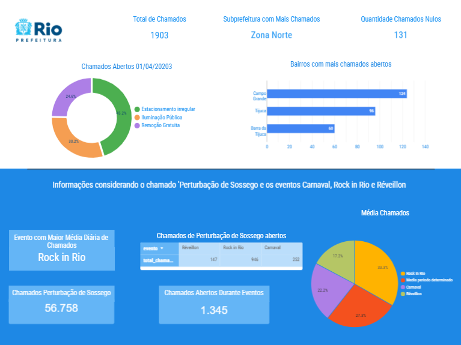

# Data Analysis Project

Este repositório contém dois scripts Python independentes para análise de dados:
1. **Análise de Chamados da Central 1746** - Análise dos chamados registrados na central de atendimento da prefeitura
2. **Análise de Feriados e Clima** - Correlação entre feriados nacionais e dados climáticos

### Ferramentas e Recursos

Você precisará de acesso ao Google Cloud Platform (GCP) para utilizar o BigQuery e consultar os dados públicos disponíveis no projeto `datario`. Além disso, vamos utilizar a biblioteca `basedosdados` em Python para acessar os dados do BigQuery.

- Tutorial para acessar dados no BigQuery, desde a criação da conta no GCP até consultar os dados utilizando SQL e Python: [Como acessar dados no BigQuery](https://docs.dados.rio/tutoriais/como-acessar-dados/)

Todas as APIs utilizadas no desafio são públicas e possuem documentações com exemplos.

## Requisitos Gerais

Antes de executar qualquer um dos scripts, certifique-se de ter Python 3.7+ instalado em seu ambiente. Para instalar todas as dependências necessárias, execute:

```bash
pip install -r requirements.txt
```

## 1. Análise de Chamados da Central 1746

### Descrição
Este script analisa os dados de chamados registrados na central de atendimento 1746 da prefeitura do Rio de Janeiro, realizando consultas em bancos de dados públicos através da biblioteca BaseDOsDados.

### Configuração
Para executar este script, você precisará de acesso ao projeto DataRio no Google BigQuery:

1. Configure suas credenciais do Google Cloud Platform
2. Verifique se o ID do projeto `datario-454017` está acessível para sua conta

### Como Executar
Execute o script com o comando:
# 1. Instalar dependências (se ainda não estiverem instaladas)
```bash
pip install requirements.txt
```
# 2. Execute o codigo referente a analise dos dados

```bash
python analise_python.py
```

### Funcionalidades
O script realiza as seguintes análises:
- Volume de chamados em uma data específica (01/04/2023)
- Tipos de chamados mais frequentes
- Distribuição geográfica por bairros e subprefeituras
- Análise de chamados de perturbação do sossego
- Correlação entre chamados e eventos especiais da cidade (Carnaval, Réveillon, Rock in Rio)

### Saída
Os resultados são exibidos diretamente no console, incluindo um resumo ao final da execução.

## 2. Análise de Feriados e Clima

### Descrição
Este script analisa a relação entre feriados nacionais brasileiros e dados climáticos para o Rio de Janeiro em 2024, determinando quais feriados seriam mais "aproveitáveis" com base nas condições climáticas.

### Configuração
Este script requer configuração de variáveis de ambiente para as APIs utilizadas:

1. Certifique-se de que o arquivo `.env` foi importado para sua maquina caso não crie um com o conteudo:
```
API_HOLIDAY=https://date.nager.at/api/v3/PublicHolidays
API_OPEN-METEO=https://archive-api.open-meteo.com/v1/archive
```

2. Certifique-se de que o arquivo `descriptions.json` esteja presente na mesma pasta do script. Este arquivo contém as descrições dos códigos climáticos.

### Como Executar
Execute o script com o comando:
# 1. Instalar dependências (se ainda não estiverem instaladas)
```bash
pip install requirements.txt
```
# 2. Execute o codigo referente a analise dos dados

```bash
python analise_api.py
```
### Funcionalidades
O script realiza as seguintes análises:
- Contagem de feriados nacionais em 2024
- Identificação do mês com maior número de feriados
- Contagem de feriados que caem em dias úteis
- Temperatura média mensal para o Rio de Janeiro
- Condições climáticas predominantes por mês
- Análise de temperatura e clima em cada feriado
- Identificação de feriados "não aproveitáveis" (temperatura baixa ou clima ruim)
- Identificação do feriado mais "aproveitável" (melhor combinação de temperatura e clima)

### Saída
Os resultados são exibidos diretamente no console, com separadores claros entre cada análise.

## Observações
- Ambos os scripts são independentes e podem ser executados separadamente
- O primeiro script requer acesso ao Google BigQuery
- O segundo script requer as APIs externas configuradas no arquivo `.env`
- Para questões ou problemas, abra uma issue neste repositório

### Visualização de Dados
Uma visualização interativa dos resultados da análise está disponível no Looker Studio:
[Dashboard de Análise dos Chamados 1746](https://lookerstudio.google.com/s/jQW8tqM2tCQ)

